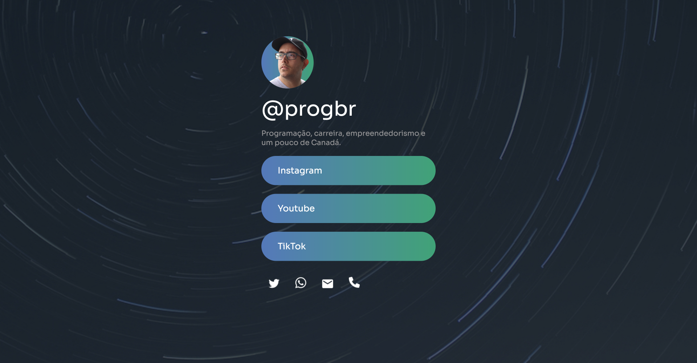

<h1>Sobre o Projeto</h1>

Este é um projeto de teste do módulo de CSS Avançado do curso de Desenvolvimento Web Full Stack do <a href="https://programadorbr.club.hotmart.com/">ProgramadorBR.</a>

A ideia original do mentor do curso era ter um ambiente capaz de integrar todos os links de redes sociais e contato num só lugar, como pode ser visto no modelo proposto abaixo e no meu resultado.

<h2>Modelo Proposto no Curso</h2>

<h2>Resultado Obtido</h2>

